# SiSoftware Sandra Auto-Reinstall Scripts

Automated batch scripts for uninstalling and reinstalling **SiSoftware Sandra Lite** on Windows systems. These scripts are designed to be run from a USB drive, enabling hands-free software deployment.

---

## 🛡️ Safety Notice

> [!IMPORTANT]
> **This script is SAFE and does NOT harm your system.**

This script performs **only the following safe operations**:

| Action | Scope | System Impact |
|--------|-------|---------------|
| `taskkill` | Terminates only Sandra-related processes | ✅ No system processes affected |
| `unins000.exe` | Runs Sandra's own official uninstaller | ✅ Standard Windows uninstall |
| `rmdir` | Removes only Sandra's installation folder | ✅ No other files touched |
| `san31137.exe` | Runs the official Sandra installer | ✅ Standard Windows install |

**What this script does NOT do:**
- ❌ Does NOT modify Windows registry (beyond normal install/uninstall)
- ❌ Does NOT delete any user files or documents
- ❌ Does NOT affect other installed programs
- ❌ Does NOT require internet connection
- ❌ Does NOT send any data externally
- ❌ Does NOT restart your computer

The administrator privilege request is **only** needed because installing/uninstalling programs in `Program Files` requires elevated permissions — this is standard Windows behavior.

---

## 🔄 Process Flow Diagram

```mermaid
flowchart TD
    A[🚀 Script Start] --> B{Admin Rights?}
    B -->|No| C[Request UAC Elevation]
    C --> D[Restart with Admin]
    D --> B
    B -->|Yes| E[Step 1: Kill Processes]
    
    E --> F{Sandra.exe running?}
    F -->|Yes| G[Force terminate]
    F -->|No| H[Skip - No error]
    G --> H
    H --> I[Step 2: Uninstall]
    
    I --> J{Uninstaller exists?}
    J -->|Yes| K[Run Silent Uninstall]
    J -->|No| L[Skip - Show warning]
    K --> M[Clean residual folders]
    L --> M
    
    M --> N[Step 3: Install]
    N --> O{san31137.exe exists?}
    O -->|Yes| P[Run Silent Install]
    O -->|No| Q[❌ Error: File not found]
    P --> R[✅ Complete!]
    Q --> S[Script ends with error]
    R --> T[Window closes in 5 sec]
```



**Execution Timeline:**
```
[0s]     → Check admin rights
[1-2s]   → Kill any running Sandra processes
[2-4s]   → Wait buffer
[4-30s]  → Uninstall (if installed)
[30-32s] → Clean leftover files
[32-60s] → Install fresh copy
[60-65s] → Display completion message
[65s]    → Auto-close window
```

---

## 📁 Files Overview

| File | Purpose |
|------|---------|
| `auto_production.bat` | **Production version** – Fully automated, silent execution |
| `auto.bat` | **Debug version** – Interactive mode with pause points for troubleshooting |
| `san31137.exe` | SiSoftware Sandra Lite installer (must be in the same directory) |

---

## 🚀 How It Works

Both scripts perform the same three-step process:

### Step 1: Force Close Running Programs
```batch
taskkill /F /IM Sandra.exe
taskkill /F /IM RpcSandbox.exe
taskkill /F /IM W32Sandra.exe
```
**Why:** Before uninstalling, any running instances of Sandra must be terminated. If these processes are locked, the uninstaller will fail. The `/F` flag forces termination without asking.

### Step 2: Uninstall Existing Installation
```batch
start /wait "" "%UNINS%" /VERYSILENT /SUPPRESSMSGBOXES /NORESTART
```
**Why:** The script locates the uninstaller (`unins000.exe`) in the program directory and runs it with silent flags to avoid user prompts. This ensures a clean removal before reinstallation.

**Path Detection Logic:**
1. First checks: `%ProgramFiles%\SiSoftware\SiSoftware Sandra Lite 2021`
2. Falls back to: `%ProgramFiles%\SiSoftware\SiSoftware Sandra Lite`

### Step 3: Install Fresh Copy
```batch
start /wait "" "san31137.exe" /VERYSILENT /SUPPRESSMSGBOXES
```
**Why:** Installs the new version silently using the installer file located in the same directory as the script.

---

## 🔐 Administrator Privileges

### The Elevation Mechanism
```batch
>nul 2>&1 "%SYSTEMROOT%\system32\cacls.exe" "%SYSTEMROOT%\system32\config\system"

if '%errorlevel%' NEQ '0' (
    powershell -Command "Start-Process -FilePath '%~f0' -Verb RunAs"
    exit /b
)
```

**How it works:**
1. **Detection:** Attempts to access a protected system file (`config\system`) using `cacls.exe`
2. **If access denied (not admin):** Restarts the script with PowerShell's `RunAs` verb to request UAC elevation
3. **If access granted (is admin):** Continues with the main script

**Why this approach:**
- The `cacls.exe` test is a reliable method to check admin rights without external tools
- Using PowerShell's `Start-Process -Verb RunAs` triggers the standard Windows UAC prompt
- The script exits and relaunches itself with elevated privileges

---

## 🔧 Key Technical Details

### Delayed Expansion
```batch
setlocal EnableDelayedExpansion
```
**Why:** Enables the use of `!variable!` syntax inside code blocks like `if` statements. Without this, variables set inside parentheses wouldn't be accessible until after the block completes.

### Working Directory Lock
```batch
cd /d "%~dp0"
```
**Why:** Ensures the script always runs from its own directory (where the USB is mounted), regardless of where it was launched from. The `/d` flag allows changing drives if needed.

### Silent Installer Flags

| Flag | Purpose |
|------|---------|
| `/VERYSILENT` | No user interface shown during installation/uninstallation |
| `/SUPPRESSMSGBOXES` | Prevents any message boxes from appearing |
| `/NORESTART` | Prevents automatic system restart |

These flags are **Inno Setup** specific (the installer framework used by SiSoftware Sandra).

### Error Suppression (Production Only)
```batch
taskkill /F /IM Sandra.exe >nul 2>&1
```
**Why:** Redirects both stdout (`>nul`) and stderr (`2>&1`) to null, hiding "process not found" errors when the program isn't running. This keeps the output clean in production.

### Residual Cleanup
```batch
if exist "!TARGET_DIR!" rmdir /s /q "!TARGET_DIR!"
```
**Why:** Some uninstallers leave behind empty folders or configuration files. This ensures complete removal before fresh installation.

---

## 📊 Production vs Debug Comparison

| Feature | `auto_production.bat` | `auto.bat` |
|---------|----------------------|------------|
| User interaction | None | Pause at each step |
| Error visibility | Suppressed | Shown |
| Auto-close window | Yes (5 seconds) | No (manual close) |
| Use case | Deployment | Troubleshooting |

---

## 📋 Usage Instructions

### Production Mode
1. Copy `auto_production.bat` and `san31137.exe` to a USB drive
2. Double-click `auto_production.bat`
3. Accept the UAC prompt
4. Wait for completion (window closes automatically)

### Debug Mode
1. Copy `auto.bat` and `san31137.exe` to a USB drive
2. Double-click `auto.bat`
3. Accept the UAC prompt
4. Review output at each pause point
5. Press Enter to continue between steps

---

## ⚠️ Troubleshooting

| Issue | Cause | Solution |
|-------|-------|----------|
| "File not found" error | Installer missing | Ensure `san31137.exe` is in the same folder |
| Uninstaller not found | Sandra not installed | Script will skip uninstall and proceed to install |
| Access denied errors | Not running as admin | Re-run the script and accept UAC prompt |
| Program still running error | Process kill failed | Manually close Sandra from Task Manager |

---

## 🐛 Report an Issue

If you encounter any problems while running this script, **please report the issue** so we can improve it!

### How to Report

1. **Run the Debug Version** (`auto.bat`) instead of production
2. **Take a screenshot** of the error message or unexpected behavior
3. **Note which step failed:**
   - [ ] Step 1: Killing processes
   - [ ] Step 2: Uninstalling
   - [ ] Step 3: Installing
   - [ ] UAC/Admin elevation
   - [ ] Other

### Information to Include

| Required Info | Example |
|---------------|---------|
| Windows Version | Windows 10 Pro 22H2 |
| Step where it failed | Step 2 - Uninstall |
| Error message | "Uninstaller NOT found" |
| Was Sandra already installed? | Yes / No |
| Screenshot | (attach image) |

### Contact

> [!NOTE]
> Please reach out with any issues, questions, or suggestions for improvement.
> 
> Your feedback helps us make this tool better for everyone!

---

## 📜 License

This script is provided as-is for internal use. SiSoftware Sandra Lite is a product of SiSoftware.
