# Sandra Auto-Reinstall (USB Version)

**Manual USB-based reinstall** — Plug in the USB, run the script, and watch it work.

---

## 🛡️ Safety Notice

> [!IMPORTANT]
> **This script is SAFE and does NOT harm your system.**

| Action | Scope | System Impact |
|--------|-------|---------------|
| `taskkill` | Terminates only Sandra-related processes | ✅ No system processes affected |
| `unins000.exe` | Runs Sandra's own official uninstaller | ✅ Standard Windows uninstall |
| `rmdir` | Removes only Sandra's installation folder | ✅ No other files touched |
| `san31137.exe` | Runs the official Sandra installer | ✅ Standard Windows install |

---

## 📁 USB Contents

```
USB Drive/
├── auto_production.bat  ← Production (fully automatic)
├── auto.bat             ← Debug (pause at each step)
└── san31137.exe         ← Installer (required)
```

---

## 🚀 How It Works

```mermaid
flowchart TD
    A[🔌 Plug in USB] --> B[Run .bat file]
    B --> C{Admin Rights?}
    C -->|No| D[UAC Prompt]
    D --> C
    C -->|Yes| E[Step 1: Kill Processes]
    E --> F[Step 2: Uninstall]
    F --> G[Step 3: Install]
    G --> H[✅ Complete!]
```



### Three Steps:
1. **Kill Processes** — Force close Sandra.exe, RpcSandbox.exe, W32Sandra.exe
2. **Uninstall** — Run `unins000.exe` silently
3. **Install** — Run `san31137.exe` silently

---

## 📊 Production vs Debug

| Feature | `auto_production.bat` | `auto.bat` |
|---------|----------------------|------------|
| User interaction | None | Pause at each step |
| Error visibility | Hidden | Shown |
| Auto-close | Yes (5 sec) | Manual |
| Use case | Normal deployment | Troubleshooting |

---

## 📋 Usage

### Production Mode (Recommended)
1. Insert USB with files
2. Double-click `auto_production.bat`
3. Accept UAC prompt
4. Wait ~60 seconds
5. Done! Remove USB

### Debug Mode
1. Insert USB with files
2. Double-click `auto.bat`
3. Accept UAC prompt
4. Review output at each step
5. Press Enter to continue

---

## ⚠️ Troubleshooting

| Issue | Solution |
|-------|----------|
| "File not found" | Ensure `san31137.exe` is in the same folder |
| Access denied | Right-click → Run as administrator |
| Uninstaller not found | Sandra not installed (script will skip to install) |

---

## 🐛 Report an Issue

If you encounter problems:
1. Run `auto.bat` (debug version)
2. Screenshot the error
3. Note which step failed (1, 2, or 3)
