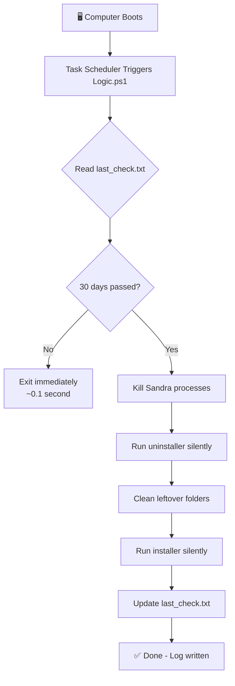

# Sandra Auto-Reset System (Windows Scheduler Version)

**30-Day Automatic Reinstall System** — Set it once and forget it. The computer handles everything on its own.

---

## 🛡️ Safety Notice

> [!IMPORTANT]
> **This system is SAFE and does NOT harm the PC.**

| Component | Action | System Impact |
|-----------|--------|---------------|
| `Logic.ps1` | Runs at boot, checks date | ✅ Exits in <0.1s if not needed |
| `0_Setup.bat` | One-time setup only | ✅ Standard Windows operations |
| Task Scheduler | Built-in Windows feature | ✅ No third-party software |

**What this system does NOT do:**
- ❌ Does NOT run continuously (only at boot)
- ❌ Does NOT use CPU/memory when not reinstalling
- ❌ Does NOT require internet connection
- ❌ Does NOT affect other programs
- ❌ Does NOT restart the computer

---

## 📁 USB Contents (3 Files Only)

```
USB Drive/
├── 0_Setup.bat      ← Double-click this (Run as Admin)
├── Logic.ps1        ← Brain (auto-copied to C:\Sandra_Auto)
└── san31137.exe     ← Installer (auto-copied to C:\Sandra_Auto)
```

---

## 🔄 How It Works



### Timeline at Each Boot:
```
[Boot]     → Windows starts
[+5 sec]   → Task Scheduler runs Logic.ps1
[+5.1 sec] → Script checks date → 30 days? 
            ├─ NO  → Exit (user never notices)
            └─ YES → Start reinstall (~60 sec)
```

---

## 🚀 Deployment for 120 PCs

### One-Time Setup Per PC:

1. **Insert USB** into the target PC
2. **Right-click** `0_Setup.bat` → **Run as administrator**
3. **Wait** for "SUCCESS" message (~3 seconds)
4. **Remove USB** and move to next PC

### What Happens After Setup:

| Location | Contents |
|----------|----------|
| `C:\Sandra_Auto\` | `san31137.exe`, `Logic.ps1`, `last_check.txt`, `history.log` |
| Task Scheduler | "Sandra_Auto_Reset" task (runs at startup) |

---

## 📋 File Explanations

### `Logic.ps1` (The Brain)

| Function | Description |
|----------|-------------|
| Date Check | Reads `last_check.txt` and calculates days since last install |
| Early Exit | If <30 days, exits immediately (no CPU usage) |
| Process Kill | Stops Sandra.exe, RpcSandbox.exe, W32Sandra.exe |
| Uninstall | Runs `unins000.exe` with silent flags |
| Cleanup | Removes leftover folders |
| Install | Runs `san31137.exe` with silent flags |
| Logging | Records all actions to `history.log` |

### `0_Setup.bat` (The Installer)

| Step | Action |
|------|--------|
| 1 | Check admin rights |
| 2 | Create `C:\Sandra_Auto` folder |
| 3 | Copy `san31137.exe` and `Logic.ps1` from USB |
| 4 | Register "Sandra_Auto_Reset" in Task Scheduler |

---

## 📊 Verification

### Check If Setup Was Successful:

1. Open **Task Scheduler** (search "Task Scheduler" in Start)
2. Look for **"Sandra_Auto_Reset"** in the task list
3. Check `C:\Sandra_Auto\` folder exists with files

### Check History Log:

```powershell
Get-Content C:\Sandra_Auto\history.log
```

Example output:
```
[2026-01-21 10:45] First run detected.
[2026-01-21 10:45] Installing new version...
[2026-01-21 10:46] Installation complete. Date updated.
[2026-02-20 09:30] Last install was 30 days ago. Starting reinstall.
...
```

---

## ⚠️ Troubleshooting

| Issue | Cause | Solution |
|-------|-------|----------|
| Setup fails | Not running as admin | Right-click → Run as administrator |
| Files not copied | USB not detected | Ensure USB is properly inserted |
| Task not running | Scheduler disabled | Enable Task Scheduler service |
| Reinstall not happening | Date not reached | Wait 30 days or delete `last_check.txt` |

### Force Immediate Reinstall (For Testing):

```powershell
# Delete the date file to trigger reinstall on next boot
Remove-Item C:\Sandra_Auto\last_check.txt
# Then restart the computer
```

### Remove System Completely:

```powershell
# Run as Administrator
schtasks /delete /tn "Sandra_Auto_Reset" /f
Remove-Item C:\Sandra_Auto -Recurse -Force
```

---

## 🐛 Report an Issue

If you encounter problems, please report:

1. **Which step failed** (Setup or Auto-reinstall)
2. **Error message** (screenshot if possible)
3. **Windows version**
4. **Contents of** `C:\Sandra_Auto\history.log`

---

## 📜 Summary

| Feature | Value |
|---------|-------|
| Files needed on USB | 3 |
| Setup time per PC | ~3 seconds |
| Reinstall interval | 30 days |
| User interaction after setup | None |
| Performance impact | None (exits in 0.1s if not needed) |
