# Sandra Auto-Reset System (Windows Scheduler Version)

**30-Day Automatic Reinstall System** — Set it once and forget it. The computer handles everything on its own.

---

## 🛡️ Safety Notice

> [!IMPORTANT]
> **This system is SAFE and does NOT harm the PC.**

| Component | Action | System Impact |
|-----------|--------|---------------|
| `Logic.ps1` | Runs at boot/logon, checks date | ✅ Exits in <0.1s if not needed |
| `0_Setup.bat` | One-time setup only | ✅ Standard Windows operations |
| Task Scheduler | Built-in Windows feature | ✅ No third-party software |

**What this system does NOT do:**
- ❌ Does NOT run continuously (only at boot/logon)
- ❌ Does NOT use CPU/memory when not reinstalling
- ❌ Does NOT require internet connection
- ❌ Does NOT affect other programs

---

## 📁 USB Contents (3 Files Only)

```
USB Drive/
├── 0_Setup.bat      ← Double-click this (auto-requests admin)
├── Logic.ps1        ← Brain (auto-copied to C:\Sandra_Auto)
└── san31137.exe     ← Installer (auto-copied to C:\Sandra_Auto)
```

---

## 🔄 How It Works (Final Logic)

### Dual Trigger System
| Trigger | When | Purpose |
|---------|------|---------|
| **AtStartup** | System boots (1 min delay) | Catches cold boot |
| **AtLogOn** | User logs in | Catches VM resume, fast startup |

### Dual Date Check System
| Method | Source | When Used |
|--------|--------|-----------|
| **Method 1** | `san31137.exe` file modification date | Primary check |
| **Method 2** | `last_check.txt` date record | Backup if file date fails |

**If EITHER method detects 30+ days → Reinstall triggers**

### Safety Features
| Feature | Description |
|---------|-------------|
| **System Mutex** | Prevents duplicate execution (even with dual triggers) |
| **File Date Retry** | 3 retry attempts with verification |
| **Detailed Logging** | All actions logged to `history.log` |
| **Auto Reboot** | 30 second delay with Windows notification |

```mermaid
flowchart TD
    A[🖥️ Computer Boots] --> T1[Trigger 1: AtStartup]
    A2[👤 User Logs In] --> T2[Trigger 2: AtLogOn]
    T1 --> M[Acquire Mutex Lock]
    T2 --> M
    M --> |Already Locked| X[Exit - Another instance running]
    M --> |Lock Acquired| C[Check Dates]
    C --> E{Either 30+ days?}
    E --> |No| F[Release Mutex & Exit]
    E --> |Yes| G[Kill Sandra processes]
    G --> H[Run uninstaller silently]
    H --> I[Clean leftover folders]
    I --> J[Run installer silently]
    J --> K[Update BOTH date markers]
    K --> L[Reboot in 30 seconds]
```



---

## 🚀 Deployment for 120 PCs

### One-Time Setup Per PC:

1. **Insert USB** into the target PC
2. **Double-click** `0_Setup.bat` (auto-requests admin rights)
3. **Wait** for "SUCCESS" message (~3 seconds)
4. **Remove USB** and move to next PC

### What Happens After Setup:

| Location | Contents |
|----------|----------|
| `C:\Sandra_Auto\` | `san31137.exe`, `Logic.ps1`, `last_check.txt`, `history.log` |
| Task Scheduler | "Sandra_Auto_Reset" task (dual triggers: startup + logon) |

---

## 🧪 Verification Guide

### Step 1: Verify Task Registration
```powershell
# Check if task exists
Get-ScheduledTask -TaskName "Sandra_Auto_Reset"

# Verify 2 triggers are registered
(Get-ScheduledTask -TaskName "Sandra_Auto_Reset").Triggers.Count
# Expected: 2

# View trigger details
(Get-ScheduledTask -TaskName "Sandra_Auto_Reset").Triggers | Format-List
```

### Step 2: Verify Files Installed
```powershell
# Check all required files exist
Test-Path "C:\Sandra_Auto\san31137.exe"  # Expected: True
Test-Path "C:\Sandra_Auto\Logic.ps1"      # Expected: True
```

### Step 3: Test Reinstall Trigger (Simulated 40 days)
```powershell
# Set file date to 40 days ago
(Get-Item "C:\Sandra_Auto\san31137.exe").LastWriteTime = (Get-Date).AddDays(-40)

# Run script manually
powershell -ExecutionPolicy Bypass -File "C:\Sandra_Auto\Logic.ps1"

# Check log - should show reinstall process
Get-Content C:\Sandra_Auto\history.log -Tail 10
```

**Expected Log Output:**
```
[2026-01-21 21:15] File check: Modified 40 days ago
[2026-01-21 21:15] Date file check: 0 days since last record
[2026-01-21 21:15] Reinstall triggered. Reason: File modification date: 40 days
[2026-01-21 21:15] Stopping Sandra processes...
[2026-01-21 21:15] Uninstalling existing version...
[2026-01-21 21:15] Cleaning residual folders...
[2026-01-21 21:15] Installing new version...
[2026-01-21 21:16] Updating date markers...
[2026-01-21 21:16] File date updated successfully: 01/21/2026 21:16:06
[2026-01-21 21:16] Installation complete. Date markers updated.
[2026-01-21 21:16] Rebooting in 30 seconds to apply changes...
```

### Step 4: Test Scheduler Trigger (Real Reboot)
```powershell
# Set file date to 40 days ago
(Get-Item "C:\Sandra_Auto\san31137.exe").LastWriteTime = (Get-Date).AddDays(-40)

# Reboot and wait for auto-trigger
shutdown /r /t 10
```

After reboot, verify:
```powershell
# Check task ran successfully
Get-ScheduledTaskInfo -TaskName "Sandra_Auto_Reset"
# Expected: LastTaskResult = 0

# Check log for auto-triggered reinstall
Get-Content C:\Sandra_Auto\history.log -Tail 10
```

### Step 5: Test Skip Logic (Under 30 days)
```powershell
# Verify dates are recent (should be 0 days)
(Get-Item "C:\Sandra_Auto\san31137.exe").LastWriteTime
Get-Content "C:\Sandra_Auto\last_check.txt"

# Run script - should exit immediately
powershell -ExecutionPolicy Bypass -File "C:\Sandra_Auto\Logic.ps1"

# Log should show exit without action
Get-Content C:\Sandra_Auto\history.log -Tail 3
```

**Expected Log Output:**
```
[2026-01-21 21:17] File check: Modified 0 days ago
[2026-01-21 21:17] Date file check: 0 days since last record
```
(No further action = correct behavior)

---

## ⚠️ Troubleshooting

| Issue | Cause | Solution |
|-------|-------|----------|
| Setup fails | Not running as admin | Double-click triggers auto-elevation |
| Files not copied | USB not detected | Ensure USB is properly inserted |
| Task not running | Scheduler disabled | Enable Task Scheduler service |
| Task not triggering on VM | ONSTART doesn't fire on VM resume | Uses dual triggers (ONSTART + ONLOGON) |
| Reinstall not happening | Both dates under 30 days | See testing section above |
| Duplicate execution | Mutex not working | Check log for "Another instance already running" |

### Force Immediate Reinstall:
```powershell
(Get-Item "C:\Sandra_Auto\san31137.exe").LastWriteTime = (Get-Date).AddDays(-40)
shutdown /r /t 10
```

### Remove System Completely:
```powershell
schtasks /delete /tn "Sandra_Auto_Reset" /f
Remove-Item C:\Sandra_Auto -Recurse -Force
```

---

## 📜 Summary

| Feature | Value |
|---------|-------|
| Files needed on USB | 3 |
| Setup time per PC | ~3 seconds |
| Reinstall interval | 30 days |
| Trigger method | Dual (startup + logon) |
| Date check method | Dual (file date + date file) |
| Duplicate prevention | System Mutex |
| User interaction after setup | None |
| Performance impact | None (exits in 0.1s if not needed) |
| Auto reboot after reinstall | Yes (30 second warning) |
